````markdown
# SQL Querying, Aggregation & Joins — Assignment 5, 6 & 7

## Student Details

| Details | Information |
|---|---|
| **Name** | **AKHILA ANISH DAS** |
| **Roll No** | **150096725016** |
| **Database** | **order_db** |
| **Technology** | **PostgreSQL / SQL** |
| **Assignments** | **Assignment 5, Assignment 6, Assignment 7** |

---

# 📌 Project Overview

This project contains the complete SQL solutions for **Assignment 5, Assignment 6 and Assignment 7** based on the `order_db` database.

The assignment contains **18 SQL questions** divided into three parts:

- **Assignment 5 — Part A:** Querying using `SELECT`, `WHERE`, `LIKE`, `AND`, `OR` and `ORDER BY`
- **Assignment 6 — Part B:** Grouping and Aggregate Functions using `SUM`, `COUNT`, `AVG`, `GROUP BY`, `HAVING` and subqueries
- **Assignment 7 — Part C:** Joins using `INNER JOIN`, `LEFT JOIN`, `CROSS JOIN`, `GROUP BY` and `IS NULL`

The database contains the following tables:

```text
customers
products
orders
````

---

# 📂 Project Structure

```text
SQL5-6-7-AK/
│
├── A5-SS/
│   ├── Q5-Q1.png
│   ├── Q5-Q2.png
│   ├── Q5-Q3.png
│   ├── Q5-Q4.png
│   ├── Q5-Q5.png
│   └── Q5-Q6.png
│
├── A6-SS/
│   ├── Q6-Q1.png
│   ├── Q6-Q2.png
│   ├── Q6-Q3.png
│   ├── Q6-Q4.png
│   ├── Q6-Q5.png
│   └── Q6-Q6.png
│
├── A7-SS/
│   ├── Q7-Q1.png
│   ├── Q7-Q2.png
│   ├── Q7-Q3.png
│   ├── Q7-Q4.png
│   ├── Q7-Q5.png
│   └── Q7-Q6.png
│
├── Assignment5.sql
├── Assignment6.sql
├── Assignment7.sql
└── README.md
```

---

# 🗄️ Database Tables

## Customers

```text
customer_id
customer_name
city
country
```

## Products

```text
product_id
product_name
category
price
```

## Orders

```text
order_id
customer_id
product_id
order_date
quantity
```

---

# ASSIGNMENT 5

## Part A — Querying

Assignment 5 contains six questions using `SELECT`, `WHERE` and `ORDER BY`.

---

## Q1. Customers Located in India

### Question

List the `customer_name`, `city` and `country` of all customers located in **India**, sorted alphabetically by `customer_name`.

### SQL Code

```sql
-- Name: AKHILA ANISH DAS, Roll No: 150096725016

SELECT customer_name, city, country
FROM customers
WHERE country = 'India'
ORDER BY customer_name;
```

### Output

```text
 customer_name |  city  | country
---------------+--------+---------
 Anjali Verma  | Pune   | India
 Priya Singh   | Delhi  | India
 Rahul Sharma  | Mumbai | India
(3 rows)
```

### Screenshot

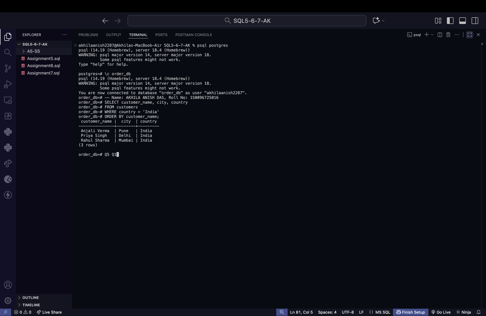

---

## Q2. Electronics Products Above 10000

### Question

Display all products in the **Electronics** category with a price greater than `10000`, sorted by price in descending order.

### SQL Code

```sql
-- Name: AKHILA ANISH DAS, Roll No: 150096725016

SELECT *
FROM products
WHERE category = 'Electronics'
  AND price > 10000
ORDER BY price DESC;
```

### Output

```text
 product_id | product_name |  category   |  price
------------+--------------+-------------+----------
        101 | Laptop       | Electronics | 55000.00
        102 | Smartphone   | Electronics | 25000.00
        110 | Monitor      | Electronics | 12000.00
(3 rows)
```

### Screenshot

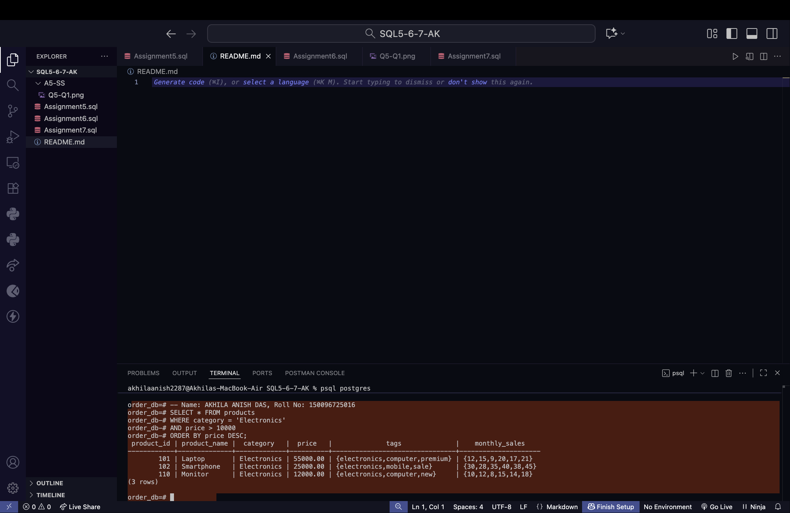

---

## Q3. Orders Placed in January 2024

### Question

Find all orders placed between `2024-01-01` and `2024-01-31`, showing `order_id`, `customer_id`, `product_id` and `order_date`.

### SQL Code

```sql
-- Name: AKHILA ANISH DAS, Roll No: 150096725016

SELECT order_id, customer_id, product_id, order_date
FROM orders
WHERE order_date BETWEEN '2024-01-01' AND '2024-01-31';
```

### Output

```text
 order_id | customer_id | product_id | order_date
----------+-------------+------------+------------
        1 |           1 |        101 | 2024-01-05
        2 |           1 |        103 | 2024-01-06
        3 |           2 |        102 | 2024-01-10
        4 |           3 |        104 | 2024-01-12
        5 |           3 |        105 | 2024-01-15
(5 rows)
```

### Screenshot

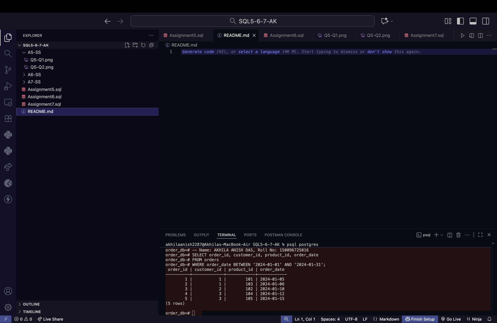

---

## Q4. Customers Outside India

### Question

List the `customer_name` and `country` of every customer who is **not based in India**.

### SQL Code

```sql
-- Name: AKHILA ANISH DAS, Roll No: 150096725016

SELECT customer_name, country
FROM customers
WHERE country <> 'India';
```

### Output

```text
 customer_name |  country
---------------+-----------
 John Smith    | USA
 Emma Watson   | UK
 Wei Chen      | China
 Sara Khan     | Pakistan
 David Miller  | Canada
 Tom Brown     | Australia
 Lisa Ray      | USA
(7 rows)
```

### Screenshot

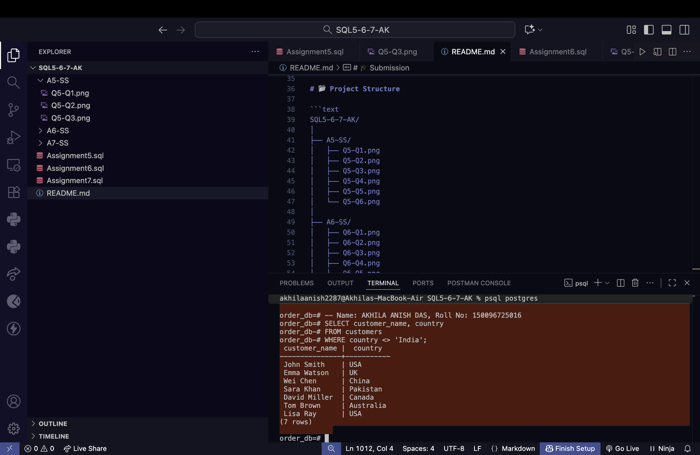

---

## Q5. Products Starting with L or Stationery

### Question

Find all products whose `product_name` starts with the letter **L**, OR whose category is **Stationery**.

### SQL Code

```sql
-- Name: AKHILA ANISH DAS, Roll No: 150096725016

SELECT *
FROM products
WHERE product_name LIKE 'L%'
   OR category = 'Stationery';
```

### Output

```text
 product_id | product_name |  category   | price
------------+--------------+-------------+--------
        101 | Laptop       | Electronics | 55000
        106 | Notebook     | Stationery  | 50
        107 | Pen          | Stationery  | 10
(3 rows)
```

### Screenshot

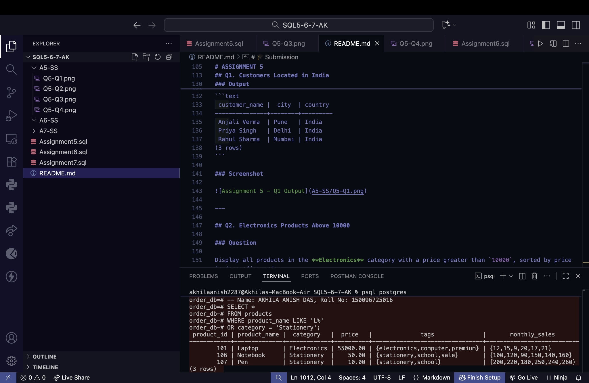

---

## Q6. Orders With Quantity Greater Than 1

### Question

Display all orders where `quantity` is greater than `1`, sorted by `order_date` in ascending order.

### SQL Code

```sql
-- Name: AKHILA ANISH DAS, Roll No: 150096725016

SELECT *
FROM orders
WHERE quantity > 1
ORDER BY order_date ASC;
```

### Output

```text
 order_id | customer_id | product_id | order_date | quantity
----------+-------------+------------+------------+----------
        2 |           1 |        103 | 2024-01-06 |        2
        4 |           3 |        104 | 2024-01-12 |        2
        6 |           4 |        106 | 2024-02-01 |        5
        7 |           5 |        107 | 2024-02-03 |       10
(4 rows)
```

### Screenshot

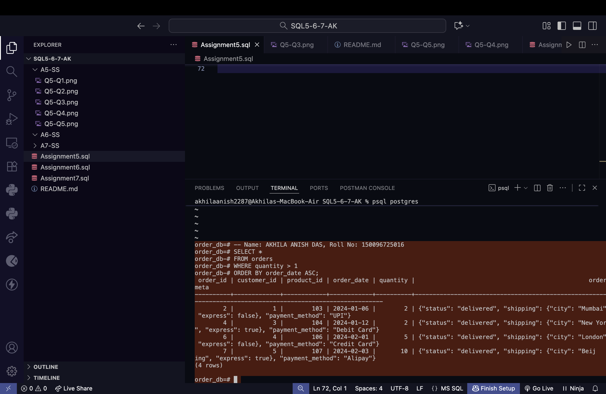

---

# ASSIGNMENT 6

## Part B — Grouping & Aggregate Functions

Assignment 6 contains six questions using aggregate functions, `GROUP BY`, `HAVING`, joins and subqueries.

---

## Q1. Total Quantity Ordered for Each Product

### Question

Find the total quantity ordered for each `product_id`.

### SQL Code

```sql
-- Name: AKHILA ANISH DAS, Roll No: 150096725016

SELECT product_id,
       SUM(quantity) AS total_quantity
FROM orders
GROUP BY product_id;
```

### Output

```text
 product_id | total_quantity
------------+---------------
        101 |             2
        102 |             2
        103 |             3
        104 |             2
        105 |             1
        106 |             5
        107 |            10
(7 rows)
```

### Screenshot

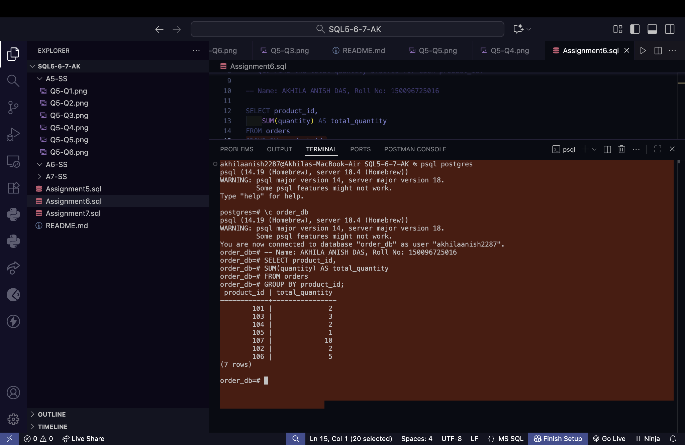

---

## Q2. Customers With More Than One Order

### Question

Find the number of orders placed by each `customer_id`, showing only customers who have placed more than one order.

### SQL Code

```sql
-- Name: AKHILA ANISH DAS, Roll No: 150096725016

SELECT customer_id,
       COUNT(*) AS order_count
FROM orders
GROUP BY customer_id
HAVING COUNT(*) > 1;
```

### Output

```text
 customer_id | order_count
-------------+------------
           1 |          2
           2 |          2
           3 |          2
(3 rows)
```

### Screenshot

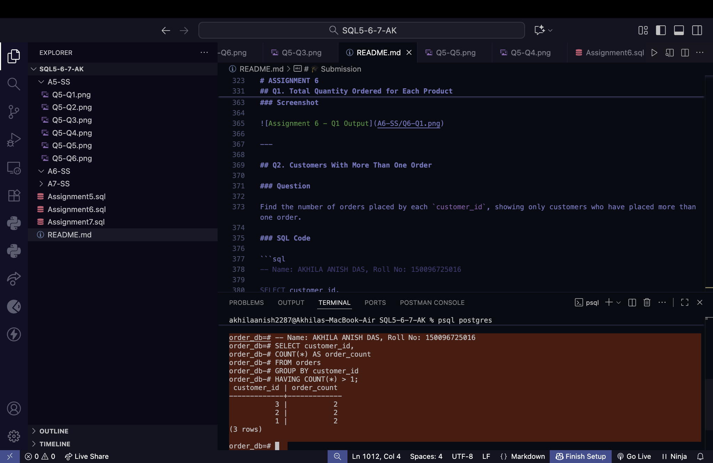

---

## Q3. Total Revenue Per Product Category

### Question

Calculate the total revenue generated per product category.

Revenue is calculated as:

```text
price × quantity
```

### SQL Code

```sql
-- Name: AKHILA ANISH DAS, Roll No: 150096725016

SELECT p.category,
       SUM(p.price * o.quantity) AS total_revenue
FROM orders o
JOIN products p
  ON o.product_id = p.product_id
GROUP BY p.category;
```

### Output

```text
 category   | total_revenue
------------+--------------
 Furniture  |     18000.00
 Electronics |    166000.00
 Stationery |       350.00
(3 rows)
```

### Screenshot

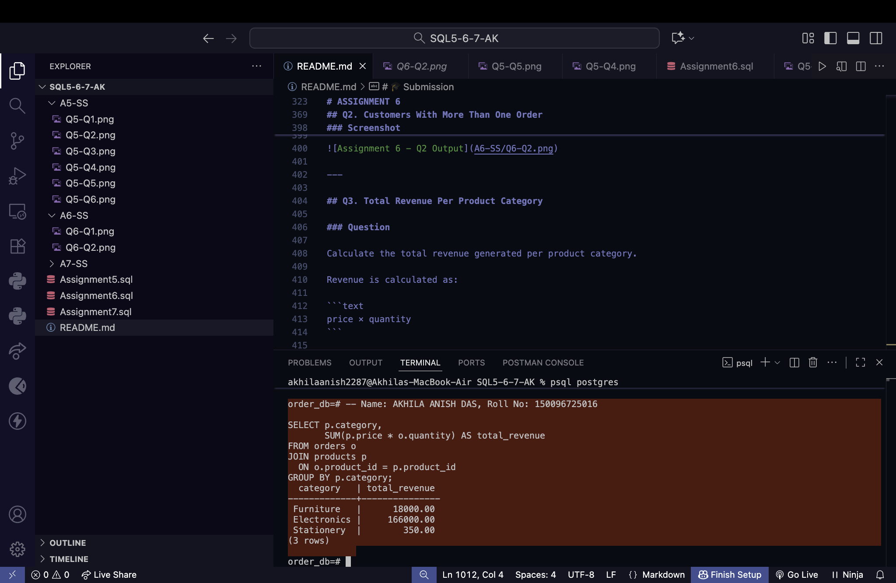

---

## Q4. Average Product Price Per Category

### Question

Find the average product price for each category, ordered from highest to lowest average price.

### SQL Code

```sql
-- Name: AKHILA ANISH DAS, Roll No: 150096725016

SELECT category,
       AVG(price) AS average_price
FROM products
GROUP BY category
ORDER BY average_price DESC;
```

### Output

```text
 category    |     average_price
-------------+-----------------------
 Electronics | 23500.000000000000
 Furniture   | 6500.0000000000000000
 Accessories | 900.0000000000000000
 Stationery  | 30.0000000000000000
(4 rows)
```

### Screenshot

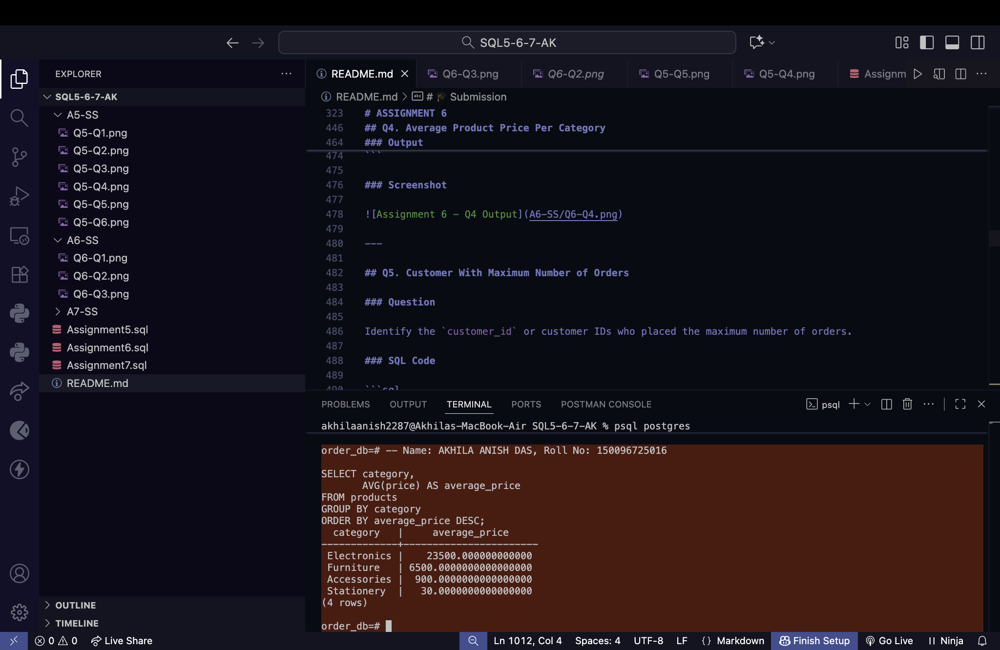

---

## Q5. Customer With Maximum Number of Orders

### Question

Identify the `customer_id` or customer IDs who placed the maximum number of orders.

### SQL Code

```sql
-- Name: AKHILA ANISH DAS, Roll No: 150096725016

SELECT customer_id,
       COUNT(*) AS order_count
FROM orders
GROUP BY customer_id
HAVING COUNT(*) = (
    SELECT MAX(order_count)
    FROM (
        SELECT customer_id,
               COUNT(*) AS order_count
        FROM orders
        GROUP BY customer_id
    ) AS counts
);
```

### Output

```text
 customer_id | order_count
-------------+------------
           1 |          2
           2 |          2
           3 |          2
(3 rows)
```

### Screenshot

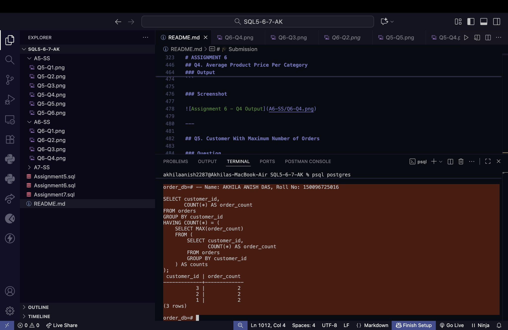

---

## Q6. Total Quantity Ordered Per Month

### Question

Extract the month from `order_date` and find the total quantity ordered in each month across all orders.

### SQL Code

```sql
-- Name: AKHILA ANISH DAS, Roll No: 150096725016

SELECT EXTRACT(MONTH FROM order_date) AS month,
       SUM(quantity) AS total_quantity
FROM orders
GROUP BY EXTRACT(MONTH FROM order_date)
ORDER BY month;
```

### Output

```text
 month | total_quantity
-------+---------------
     1 |             7
     2 |            18
(2 rows)
```

### Screenshot

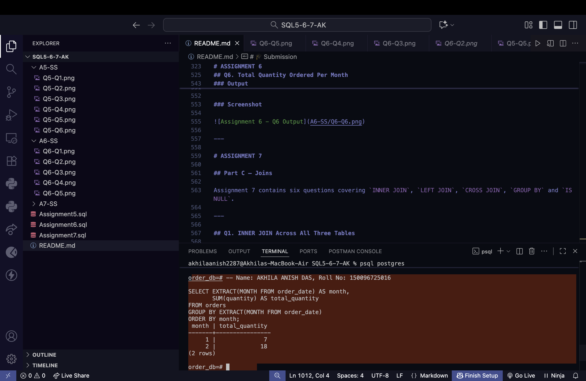

---

# ASSIGNMENT 7

## Part C — Joins

Assignment 7 contains six questions covering `INNER JOIN`, `LEFT JOIN`, `CROSS JOIN`, `GROUP BY` and `IS NULL`.

---

## Q1. INNER JOIN Across All Three Tables

### Question

Using an `INNER JOIN` across all three tables, list every order with the `customer_name`, `product_name`, `quantity` and `order_date`.

### SQL Code

```sql
-- Name: AKHILA ANISH DAS, Roll No: 150096725016

SELECT o.order_id,
       c.customer_name,
       p.product_name,
       o.quantity,
       o.order_date
FROM orders o
INNER JOIN customers c
  ON o.customer_id = c.customer_id
INNER JOIN products p
  ON o.product_id = p.product_id;
```

### Output

```text
 order_id | customer_name | product_name | quantity | order_date
----------+---------------+--------------+----------+------------
        1 | Rahul Sharma  | Laptop       |        1 | 2024-01-05
        2 | Rahul Sharma  | Headphones   |        2 | 2024-01-06
        3 | Priya Singh   | Smartphone   |        1 | 2024-01-10
        4 | John Smith    | Office Chair |        2 | 2024-01-12
        5 | John Smith    | Desk         |        1 | 2024-01-15
        6 | Emma Watson   | Notebook     |        5 | 2024-02-01
        7 | Wei Chen      | Pen          |       10 | 2024-02-03
        8 | Sara Khan     | Laptop       |        1 | 2024-02-10
        9 | David Miller  | Smartphone   |        1 | 2024-02-15
       10 | Priya Singh   | Headphones   |        1 | 2024-02-20
(10 rows)
```

### Screenshot

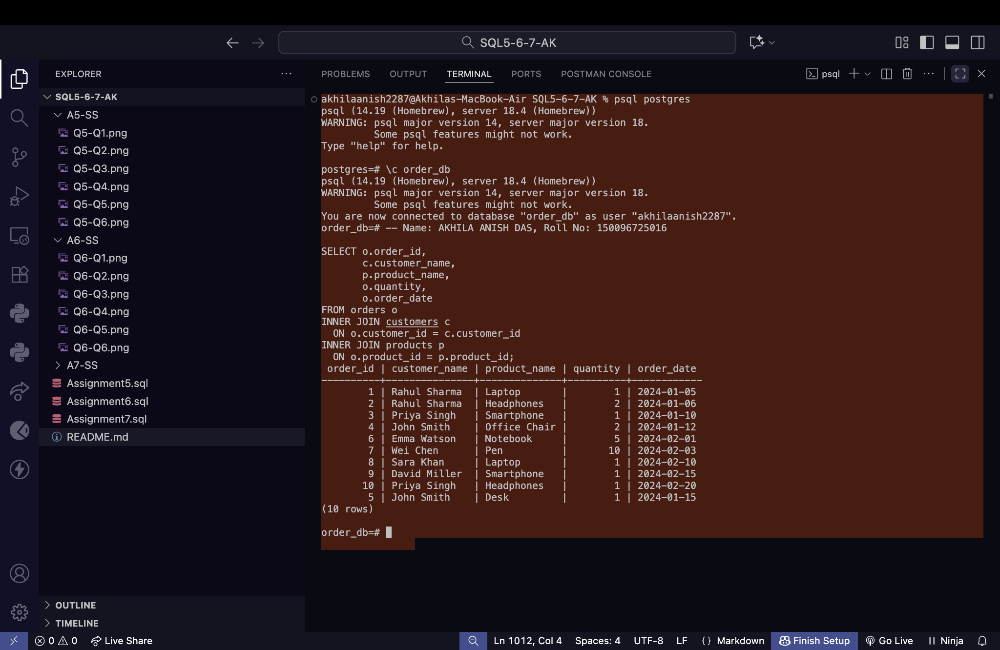

---

## Q2. LEFT JOIN Customers and Orders

### Question

Using a `LEFT JOIN` from customers to orders, list every customer and their orders. Customers with no orders must still appear with `NULL` values in the order columns.

### SQL Code

```sql
-- Name: AKHILA ANISH DAS, Roll No: 150096725016

SELECT c.customer_id,
       c.customer_name,
       o.order_id,
       o.product_id,
       o.order_date,
       o.quantity
FROM customers c
LEFT JOIN orders o
  ON c.customer_id = o.customer_id;
```

### Output

```text
 customer_id | customer_name | order_id | product_id | order_date | quantity
-------------+---------------+----------+------------+------------+---------
           1 | Rahul Sharma  |        1 |        101 | 2024-01-05 | 1
           1 | Rahul Sharma  |        2 |        103 | 2024-01-06 | 2
           2 | Priya Singh   |        3 |        102 | 2024-01-10 | 1
           2 | Priya Singh   |       10 |        103 | 2024-02-20 | 1
           3 | John Smith    |        4 |        104 | 2024-01-12 | 2
           3 | John Smith    |        5 |        105 | 2024-01-15 | 1
           4 | Emma Watson   |        6 |        106 | 2024-02-01 | 5
           5 | Wei Chen      |        7 |        107 | 2024-02-03 | 10
           6 | Sara Khan     |        8 |        101 | 2024-02-10 | 1
           7 | David Miller  |        9 |        102 | 2024-02-15 | 1
           8 | Anjali Verma |          |            |            |
           9 | Tom Brown     |          |            |            |
          10 | Lisa Ray      |          |            |            |
(13 rows)
```

### Screenshot

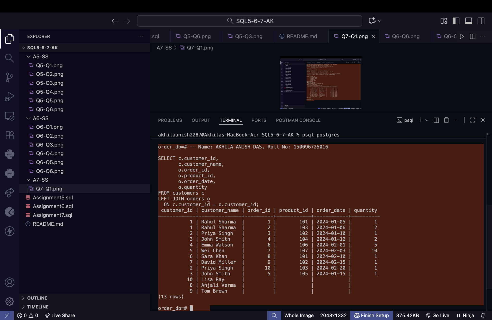

---

## Q3. Products and Their Orders

### Question

Using a `LEFT JOIN` from products to orders, list every product and its orders. Products that have never been ordered must still appear.

### SQL Code

```sql
-- Name: AKHILA ANISH DAS, Roll No: 150096725016

SELECT p.product_id,
       p.product_name,
       o.order_id,
       o.customer_id,
       o.quantity,
       o.order_date
FROM products p
LEFT JOIN orders o
  ON p.product_id = o.product_id;
```

### Output

```text
 product_id | product_name | order_id | customer_id | quantity | order_date
------------+--------------+----------+-------------+----------+------------
        101 | Laptop       |        1 |           1 |        1 | 2024-01-05
        101 | Laptop       |        8 |           6 |        1 | 2024-02-10
        102 | Smartphone   |        3 |           2 |        1 | 2024-01-10
        102 | Smartphone   |        9 |           7 |        1 | 2024-02-15
        103 | Headphones   |        2 |           1 |        2 | 2024-01-06
        103 | Headphones   |       10 |           2 |        1 | 2024-02-20
        104 | Office Chair |        4 |           3 |        2 | 2024-01-12
        105 | Desk         |        5 |           3 |        1 | 2024-01-15
        106 | Notebook     |        6 |           4 |        5 | 2024-02-01
        107 | Pen          |        7 |           5 |       10 | 2024-02-03
        108 | Water Bottle |          |             |          |
        109 | Backpack     |          |             |          |
        110 | Monitor      |          |             |          |
(13 rows)
```

### Screenshot

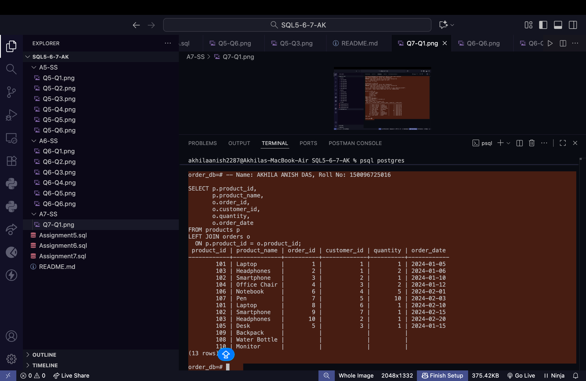

---

## Q4. CROSS JOIN Between Customers and Products

### Question

Write a `CROSS JOIN` between customers and products. State how many rows the result contains and explain why a `CROSS JOIN` is rarely useful on its own for this data.

### SQL Code

```sql
-- Name: AKHILA ANISH DAS, Roll No: 150096725016

SELECT c.customer_name,
       p.product_name
FROM customers c
CROSS JOIN products p;
```

### Output

```text
 customer_name | product_name
---------------+--------------
 Rahul Sharma  | Laptop
 Priya Singh   | Laptop
 John Smith    | Laptop
 Emma Watson   | Laptop
 Wei Chen      | Laptop
 Sara Khan     | Laptop
 David Miller  | Laptop
 Anjali Verma  | Laptop
 Tom Brown     | Laptop
 Lisa Ray      | Laptop
 ...
(100 rows)
```

### Result Explanation

There are **10 customers** and **10 products**.

Therefore:

```text
10 × 10 = 100 rows
```

A `CROSS JOIN` creates every possible customer-product combination. It is rarely useful on its own because it can generate a very large number of rows without applying a relationship between the tables.

### Screenshot

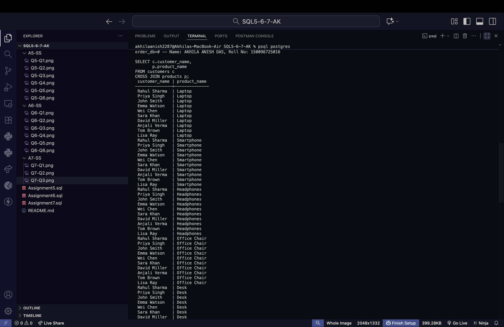

---

## Q5. Total Revenue Generated by Each Customer

### Question

Using a `JOIN` combined with `GROUP BY`, calculate the total revenue generated by each customer, sorted from highest to lowest.

### SQL Code

```sql
-- Name: AKHILA ANISH DAS, Roll No: 150096725016

SELECT c.customer_id,
       c.customer_name,
       SUM(p.price * o.quantity) AS total_revenue
FROM customers c
JOIN orders o
  ON c.customer_id = o.customer_id
JOIN products p
  ON o.product_id = p.product_id
GROUP BY c.customer_id, c.customer_name
ORDER BY total_revenue DESC;
```

### Output

```text
 customer_id | customer_name | total_revenue
-------------+---------------+--------------
           1 | Rahul Sharma  |      59000.00
           6 | Sara Khan     |      55000.00
           2 | Priya Singh   |      27000.00
           7 | David Miller  |      25000.00
           3 | John Smith    |      18000.00
           4 | Emma Watson   |        250.00
           5 | Wei Chen      |        100.00
(7 rows)
```

### Screenshot

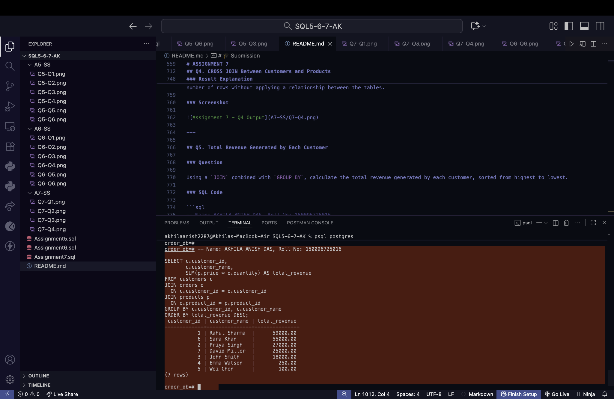

---

## Q6. Customers Who Never Placed an Order

### Question

Using a `LEFT JOIN` and `WHERE/IS NULL` condition, list all customers who have never placed an order.

### SQL Code

```sql
-- Name: AKHILA ANISH DAS, Roll No: 150096725016

SELECT c.customer_id,
       c.customer_name
FROM customers c
LEFT JOIN orders o
  ON c.customer_id = o.customer_id
WHERE o.order_id IS NULL;
```

### Output

```text
 customer_id | customer_name
-------------+---------------
           8 | Anjali Verma
           9 | Tom Brown
          10 | Lisa Ray
(3 rows)
```

### Screenshot

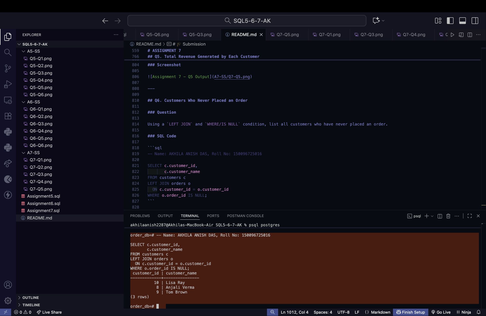

---

# 📊 Assignment Summary

| Assignment   | Part   | Topic                          | Questions |
| ------------ | ------ | ------------------------------ | --------: |
| Assignment 5 | Part A | Querying                       |         6 |
| Assignment 6 | Part B | Grouping & Aggregate Functions |         6 |
| Assignment 7 | Part C | Joins                          |         6 |
| **Total**    |        |                                |    **18** |

---

# 🧠 SQL Concepts Covered

## SELECT

Used to retrieve required columns from database tables.

## WHERE

Used to filter rows according to specified conditions.

## ORDER BY

Used to arrange query results in ascending or descending order.

## LIKE

Used for pattern matching, such as finding product names beginning with `L`.

## BETWEEN

Used to filter values within a specified range, such as January 2024 dates.

## SUM

Used to calculate total quantities and revenue.

## COUNT

Used to count the number of orders.

## AVG

Used to calculate average product prices.

## GROUP BY

Used to group rows according to a common column.

## HAVING

Used to filter grouped results.

## INNER JOIN

Returns records that have matching values in the joined tables.

## LEFT JOIN

Returns all records from the left table and matching records from the right table.

## CROSS JOIN

Produces every possible combination between two tables.

## IS NULL

Used to identify records where matching data does not exist.

---

# 🖥️ PostgreSQL Execution

The queries were executed using PostgreSQL against the `order_db` database.

Database connection:

```sql
\c order_db
```

Tables used:

```text
customers
products
orders
```

The SQL files are separated according to the assignment parts:

```text
Assignment5.sql
Assignment6.sql
Assignment7.sql
```

---

# 📸 Screenshot Documentation

Every question has its corresponding PostgreSQL terminal screenshot containing:

```text
Name and Roll Number
        ↓
SQL Query
        ↓
Query Output
```

The screenshots are organised into:

```text
A5-SS/
A6-SS/
A7-SS/
```

This keeps the SQL queries and their executed outputs organised according to the three assignment parts.

---

# ✅ Completed Assignments

```text
Assignment 5
├── Q1 ✓
├── Q2 ✓
├── Q3 ✓
├── Q4 ✓
├── Q5 ✓
└── Q6 ✓

Assignment 6
├── Q1 ✓
├── Q2 ✓
├── Q3 ✓
├── Q4 ✓
├── Q5 ✓
└── Q6 ✓

Assignment 7
├── Q1 ✓
├── Q2 ✓
├── Q3 ✓
├── Q4 ✓
├── Q5 ✓
└── Q6 ✓
```

# 🎓 Submission

**Student:** AKHILA ANISH DAS
**Roll No:** 150096725016

**Total Questions Completed: 18**

**Database:** order_db

**SQL Files:**

* `Assignment5.sql`
* `Assignment6.sql`
* `Assignment7.sql`

```
